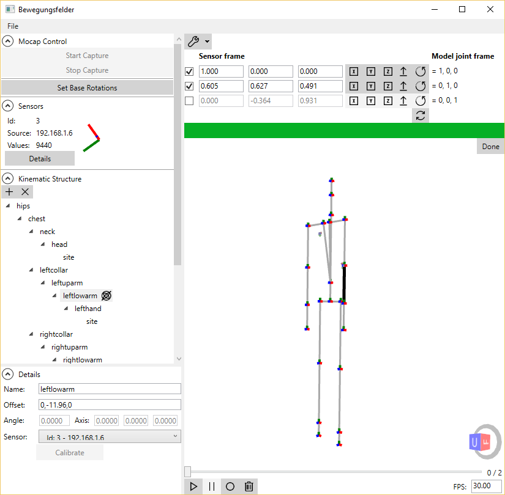
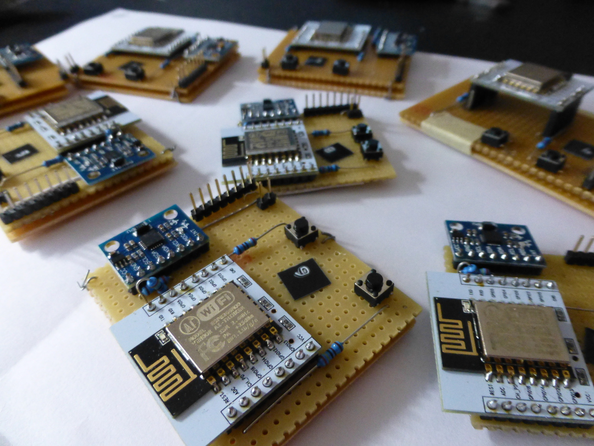

# Bewegungsfelder
Inertial Motion Capture for everyone

</img>

Bewegungsfelder is a mobile & customizable inertial motion capture system for skeletal animation. It consists of C#/WPF Application to capture and record skeletal animations and standalone IMU sensor modules based on the ESP8266 Wifi SoC.

* Flexible skeleton definition.
* Live 3D visualisation of sensors and skeleton pose.
* Recording/Playback of animations.
* BVH export & import.
* UDP Server accepts incoming sensor values.

## ESP8266 & MPU6050

Sensor fusion is done on the MPU6050 by the InvenSense DMP Firmware.

The ESP8266 reads values from the MPU6050 motion sensors using I2C.

The official Esspressif ESP8266 non-os SDK is used.

</img>
